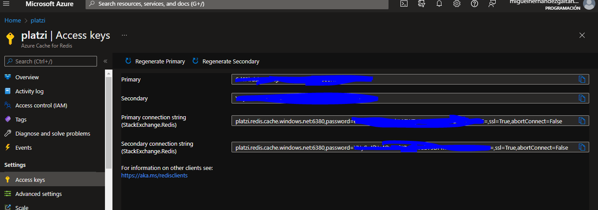

# Ejercicios de MS Learn

NOTA:

1. node-redis solo soporta redis > 5.0.0

2. node-redis no soporta el comando sendCommand

# Ventajas de Redis

1. Se ejecuta en RAM

2. Guarda todo como strings pero es inteligente para detectar tipos de datos

# Como crear una base de datos en redis?

## En Azure Portal

Primero buscas en el portal. 


Luego le das a crear y elijes las configuraciones de tu preferencia. En la opción  **Avanzado/Advanced** usa la versión 6 para evitar problemas de compatibilidad, especialmente en nodejs con node-redis.


## En Azure CLI

No es recomendable usar **--enable-non-ssl-port**

```bash	
az redis create --name platziCache --resource-group platzi-redis \ --location southcentralus --sku Basic --vm-size C0 \ --enable-non-ssl-port --tags Company=Platzi

```

Luego puedes comprobar si el comando funciono ejecutando

```bash	
az redis list --resource-group platzi-redis
```

# Como Conectarse a redis desde una terminal, fuera del azure portal

Antes de iniciar, se necesita un cliente de redis. En este caso puede usarse redis-tools desde WSL o Linux.

```bash	
sudo apt-get update
sudo apt-get upgrade
sudo apt-get install redis-tools
```

El puerto por sin seguridad es 6379, es el puerto sin ssl.

[Tutorial de usar SSL](https://www.digitalocean.com/community/tutorials/how-to-connect-to-managed-redis-over-tls-with-stunnel-and-redis-cli)


## Busca la contraseña y el host [hostname].redis.cache.windows.net



Luego en tu terminal escribes:

```bash
redis-cli -h server -p 6379 -a xxxxxxxxKEYxxxxxxx
```

Puedes usar la primary key o secondary key.

# Acciones con la terminal de redis

Algunos comandos basicos de redis

## Crear variables en redis:

```bash
set hola "Hola mundo"
get hola

```

## Crear listas en redis:

```bash
# Agrega valores a una lista
lpush lista 1 2 3 4
# Obtiene  los valores de una lista en un rango
lrange lista 0 -1
# Elimina los valores de una lista
lrem lista 0 1

```

## Crear hashes en redis:

```bash
# Agrega múltiples atributos a un hash
hmset estudiante:48 name "Doctor Who" age 25 average 4.9
# Obtiene  los valores de un atributo de un hash
hget estudiante:48 name
hget estudiante:48 age
hget estudiante:48 average
# Obtiene todos los atributos de un hash
hgetall estudiante:48
# Obtiene las keys de un hash
hkeys estudiante:48
# Obtiene las values de un hash
hvals estudiante:48
```
### Donde ver todos los comandos de redis?
[https://redis.io/commands](https://redis.io/commands)

# Instrucciones fundamentales de redis

Estas son acciones y otros comandos basicos de redis.

```bash	
# Elimina una variable
del hola
# Expira una variable
expire hola 10
# Obtiene el tiempo de expiración de una variable
ttl hola
```

## Comandos anidados

Útiles para temas de optimización para hacer en un solo request obtener los mismos resultados haciendo una latencia muy baja para obtener datos.

```bash
# getset
getset platzi-multi "Otro valor"
> (nil)
get platzi-multi
> "Otro valor"
getset platzi-multi "Ya existe"
> "Otro valor"
getset platzi-multi "ya existe de nuevo"
> "Ya existe"
mset platzi-rtp "rtp" platzi-rtc "rtc"
> OK
mget platzi-rtp platzi-rtc
> 1) "rtp"
2) "rtc"
incr platzi-uno
> 2
incrby platzi-uno 99
> 101
decr platzi-uno
> 100
decrby platzi-uno 99
> 1
```

# Clase pendiente: Arquitectura para manejos de cache con redis

# Ejercicios del curso de platzi

[Curso de Platzi](https://platzi.com/cursos/azure-redis-cache/)
