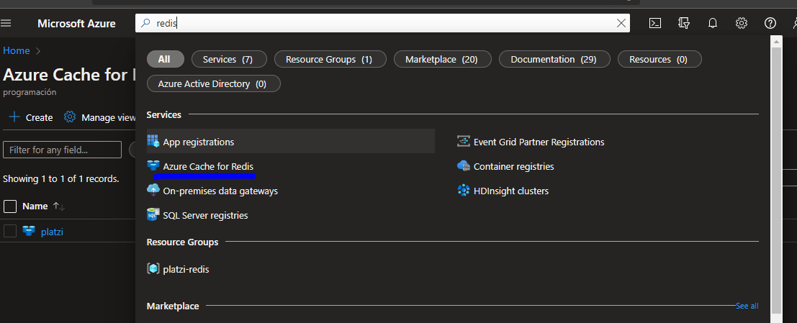
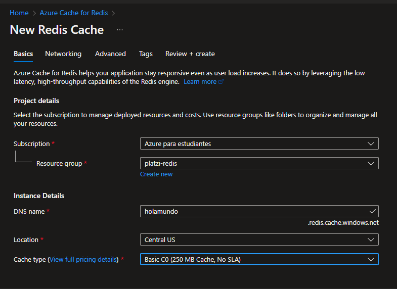

# Ejercicios de MS Learn

NOTA:

1. node-redis solo soporta redis > 5.0.0

2. node-redis no soporta el comando sendCommand

# Como crear una base de datos en redis?

## En Azure Portal

Primero buscas en el portal. 



Luego le das a crear y elijes las configuraciones de tu preferencia. En la opción  **Avanzado/Advanced** usa la versión 6 para evitar problemas de compatibilidad, especialmente en nodejs con node-redis.




## En Azure CLI

No es recomendable usar **--enable-non-ssl-port**

```bash	
az redis create --name platziCache --resource-group platzi-redis \ --location southcentralus --sku Basic --vm-size C0 \ --enable-non-ssl-port --tags Company=Platzi

```

Luego puedes comprobar si el comando funciono ejecutando

```bash	
az redis list --resource-group platzi-redis
```

# Crear variables en redis:

# Ejercicios del curso de platzi

[Curso de Platzi](https://platzi.com/cursos/azure-redis-cache/)
